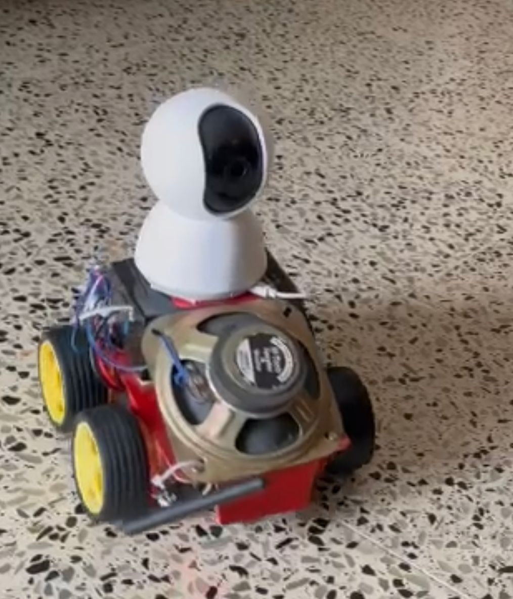

# Snake-Robot
It was funded by the Kerala State Council for Science, Technology and Environment (KSCSTE) . As inferred from the name, it resembles a biological snake. It is a four-wheel-drive surveillance device with an image capturing and audio recording facility, controlled by a wireless joystick module. It can survey hazardous areas and report back all the findings even real-time. Our team used motor-driving circuits to accomplish the project.

I have included all the required coding in appropriate files. The language is written in Arduino IDE.
Below are some snapshots:

